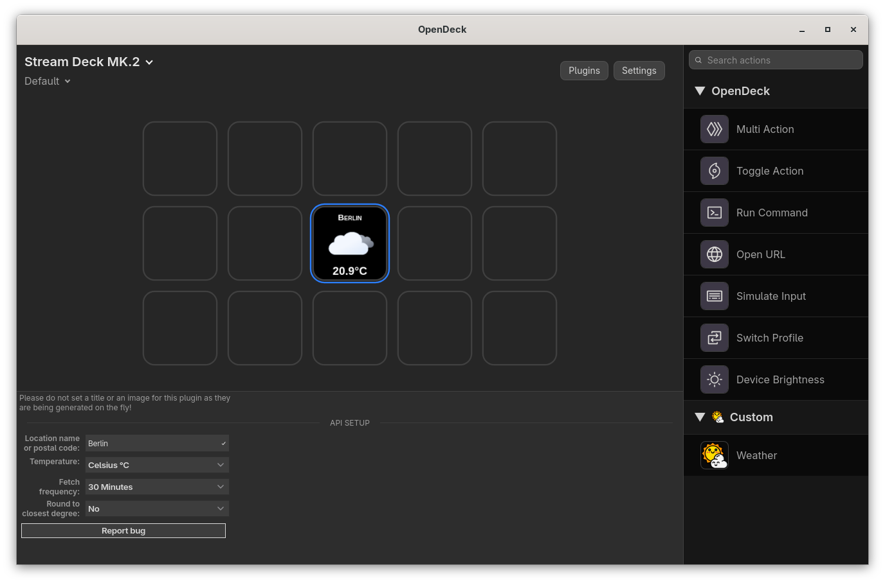

# Weather

`Weather` is a Stream Deck plugin that shows current weather using an icon, city name, and temperature directly on the key.

As of `v3.0.0`, the plugin uses **Open-Meteo** APIs (geocoding + forecast). No API key is required.

## Button settings

Do not set a custom key title or image. The plugin renders both dynamically.

- **Location name or postal code**: location query (for example `Paris, France` or `90210`)
- **Temperature**: `Celsius (°C)` or `Fahrenheit (°F)`
- **Fetch frequency**: `On push`, `10 Minutes`, `30 Minutes`, or `1 Hour`
- **Round to closest degree**: `Yes` or `No`
- **Report bug**: opens the GitHub issue form

## Features

- JavaScript implementation
- Works on Linux, macOS and Windows
- Open-Meteo integration (no API key setup)
- Automatic weather icon selection by weather code and day/night
- Optional periodic refresh

## Installation

Download `dev.lyzev.weather.streamDeckPlugin` from the project releases, then install it in OpenDeck.

## Source code

Plugin sources are in `src/dev.lyzev.weather.sdPlugin`.

Application main icon made by [Smashicons](https://www.flaticon.com/authors/smashicons) from [www.flaticon.com](https://www.flaticon.com/)
